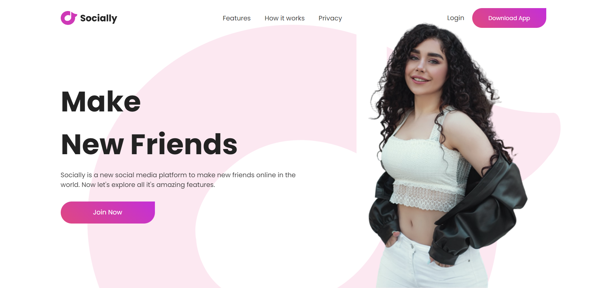

# HTML CSS | Project 1

HTML é a linguagem de marcação padrão usada para criar páginas web. Ela define a estrutura do conteúdo da página, utilizando uma série de elementos que representam diferentes tipos de conteúdo.

### Estrutura Básica

- **Elementos**: São os blocos de construção do HTML, representados por tags. Exemplo: `
`, `
`, `<a>`.
- **Atributos**: Propriedades que fornecem informações adicionais sobre os elementos. Exemplo: `class`, `id`, `src`.
- **Tags**: Marcam o início e o fim de um elemento. Exemplo: `<h1>` para o início e `</h1>` para o fim de um título de nível 1.

### Elementos Comuns

- **`
`**: Usado para agrupar e organizar outros elementos. É um contêiner genérico.
- **`
`**: Define um parágrafo de texto.
- **`<a>`**: Define um link de hipertexto.
- **``**: Insere uma imagem na página.
- **`<nav>`**: Define uma seção de navegação.

## CSS (Cascading Style Sheets)

CSS é a linguagem usada para estilizar os elementos HTML. Ele permite separar o conteúdo da apresentação visual, aplicando estilos como cores, fontes, espaçamento e layout.

### Estrutura Básica

- **Seletores**: Indicam quais elementos HTML devem ser estilizados. Exemplo: `body`, `.classe`, `#id`.
- **Propriedades**: Definem o aspecto específico que está sendo estilizado. Exemplo: `color`, `font-size`, `margin`.
- **Valores**: Especificam o valor da propriedade. Exemplo: `red`, `16px`, `auto`.

### Tipos de Seletores

- **Seletor de Elemento**: Estiliza todos os elementos de um tipo específico. Exemplo: `p` estiliza todos os parágrafos.
- **Seletor de Classe**: Estiliza elementos com um atributo `class` específico. Exemplo: `.classe`.

### Conceitos Importantes

- **Box Model**: Modelo que descreve como os elementos são renderizados na página, incluindo margens, bordas, padding e conteúdo.
- **Flexbox**: Modelo de layout que facilita a criação de layouts complexos e flexíveis.

## Exemplos de Uso

- **Layouts de Página**: Usando `div` e Flexbox para criar layouts responsivos.
- **Estilização de Texto**: Aplicando estilos a parágrafos, títulos e links.
- **Navegação**: Criando menus de navegação estilizados.

## Resultado Final

