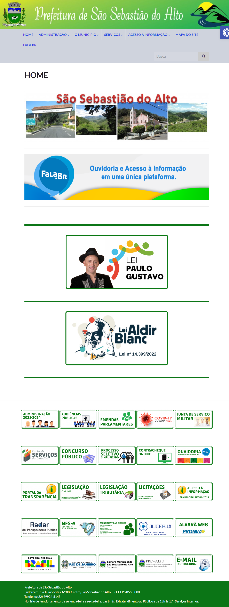

# Re-design of the São Sebastião do Alto City Hall Website / Redesign do Site da Prefeitura de São Sebastião do Alto

## English Version

### Project Overview

This project involves the redesign of the São Sebastião do Alto City Hall website. The aim is to modernize and improve the visual appeal and user experience of the site, while maintaining its current functionalities.

### Features

- **Modern Design:** Implementing a clean and contemporary look.
- **Responsive Layout:** Ensuring the site is accessible and user-friendly on all devices.
- **Improved Navigation:** Simplifying the user journey to find information quickly (some pages)
- **Enhanced Accessibility:** Making the site more accessible to users with disabilities.

### Installation

1. Clone the repository:
   ```bash
   git clone https://github.com/yourusername/sao-sebastiao-do-alto-website-redesign.git
   ```
2. Navigate to the project directory:
   ```bash
   cd sao-sebastiao-do-alto-website-redesign
   ```
3. Open the `index.html` file in your browser to view the site.

### Technologies Used

- HTML
- CSS
- JavaScript

### Contributing

Feel free to fork this repository and make changes. Pull requests are welcome!

### License

This project is licensed under the MIT License.

---

## Versão em Português

### Visão Geral do Projeto

Este projeto envolve o redesign do site da Prefeitura de São Sebastião do Alto. O objetivo é modernizar e melhorar o apelo visual e a experiência do usuário do site, mantendo suas funcionalidades atuais.

### Funcionalidades

- **Design Moderno:** Implementação de um visual limpo e contemporâneo.
- **Layout Responsivo:** Garantia de que o site seja acessível e fácil de usar em todos os dispositivos.
- **Navegação Melhorada:** Simplificação da jornada do usuário para encontrar informações rapidamente.
- **Acessibilidade Aprimorada:** Tornar o site mais acessível para usuários com deficiência.

### Instalação

1. Clone o repositório:
   ```bash
   git clone https://github.com/seuusuario/sao-sebastiao-do-alto-website-redesign.git
   ```
2. Navegue para o diretório do projeto:
   ```bash
   cd sao-sebastiao-do-alto-website-redesign
   ```
3. Abra o arquivo `index.html` em seu navegador para visualizar o site.

### Tecnologias Utilizadas

- HTML
- CSS
- JavaScript

### Contribuindo

Sinta-se à vontade para fazer um fork deste repositório e fazer alterações. Pull requests são bem-vindos!

### Licença

Este projeto está licenciado sob a Licença MIT.


# Old Version


